# Agent Mesh — Corsair Board DD Report: Information Flow
*How Aigis agents communicate to produce the Project Corsair board-level DD report*
*Generated: 1 March 2026 | Reflects actual code in `aigis_agents/`*

---

## How to Read This Document

Two complementary views of the same workflow:

1. **[Sequence Diagram](#sequence-diagram)** — who calls whom, in what order, with what data flowing across the arrows
2. **[Annotated Call Log](#annotated-call-log)** — the five critical cross-agent calls with exact Python signatures, real Corsair input/output values, and what each agent does with the result

The task being traced: *"Run the agent mesh on the Corsair VDR and produce a board-level due diligence report."*

---

## Sequence Diagram

```mermaid
%%{init: {'theme': 'dark', 'themeVariables': {'actorBkg': '#1d4ed8', 'actorTextColor': '#f8fafc', 'actorBorder': '#60a5fa', 'signalColor': '#e2e8f0', 'signalTextColor': '#e2e8f0', 'labelBoxBkgColor': '#1e293b', 'labelBoxBorderColor': '#64748b', 'labelTextColor': '#f8fafc', 'loopTextColor': '#f8fafc', 'noteBkgColor': '#312e81', 'noteTextColor': '#f8fafc', 'noteBorderColor': '#818cf8', 'activationBkgColor': '#334155', 'activationBorderColor': '#64748b', 'sequenceNumberColor': '#f8fafc'}}}%%
sequenceDiagram
    autonumber

    participant U  as Deal Team
    participant A1 as Agent 01<br/>(VDR Inventory)
    participant A2 as Agent 02<br/>(Data Store)
    participant A4 as Agent 04<br/>(Finance Calc)
    participant DK as DK Router<br/>(session singleton)
    participant AL as Audit LLM
    participant DB as SQLite DB<br/>(02_data_store.db)

    Note over U,DB: ═══  PHASE 1 — VDR DISCOVERY  ═══

    U->>A1: invoke(mode="standalone", deal_id="corsair",<br/>vdr_path="Dataroom/", deal_type="producing_asset",<br/>jurisdiction="GoM")

    rect rgb(30, 41, 59)
        Note over A1,AL: AgentBase 10-step pipeline (steps 1–6)
        A1->>DK: load(tags=["vdr_structure","checklist","board_dd_report"])
        DK-->>A1: dk_context — 87-item checklist + report playbook<br/>(session-cached on first call)
        A1->>AL: audit_input(params, dk_context)
        AL-->>A1: {approved: true}
        A1->>A1: memory.load("agent_01/learned_patterns.json")
    end

    rect rgb(15, 30, 55)
        Note over A1: _run() — core logic
        loop For each of 1,046 files in Dataroom/
            A1->>A1: stage1_keyword(filename) → candidate categories
            A1->>A1: stage2_path(folder_path) → refine
        end

        Note right of A1: 23 ambiguous files sent to<br/>main LLM for classification
        A1->>AL: classify_batch(ambiguous_files, checklist, dk_context)
        AL-->>A1: [{category, tier, confidence, label}, ×23]

        A1->>A1: novelty_detector(unmatched_files)
        A1->>AL: propose_checklist_items(novel_docs)
        AL-->>A1: [{new_item, category, rationale}, ×2]
    end

    rect rgb(30, 41, 59)
        Note over A1,AL: AgentBase steps 7–10
        A1->>AL: audit_output(manifest_1046, gaps, coverage_score)
        AL-->>A1: {approved: true,<br/>flags: ["CPR >12mo gap — request update"]}
        A1->>A1: memory.queue_suggestion("found_pattern: daily_xlsm_files")
        A1->>A1: write audit record → _audit_log.jsonl
    end

    A1-->>U: {file_manifest: [1046], gaps: [15],<br/>coverage_score: 73%,<br/>top_gaps: ["Phase 1 ESA","JOA Otto","Seismic licences"]}

    Note over U,DB: ═══  PHASE 2 — DATA INGESTION  ═══

    U->>A2: invoke(mode="standalone", deal_id="corsair",<br/>operation="ingest_vdr", vdr_path="Dataroom/",<br/>deal_type="producing_asset", jurisdiction="GoM",<br/>case_name="cpr_base_case")

    rect rgb(30, 41, 59)
        Note over A2,AL: AgentBase steps 1–6
        A2->>DK: load(tags=["financial","technical","upstream_dd","oil_gas_101"])
        DK-->>A2: dk_context (from cache — already loaded this session)
        A2->>AL: audit_input(params)
        AL-->>A2: {approved: true}
    end

    rect rgb(15, 30, 55)
        Note over A2,A1: CALL 1 — Agent 02 → Agent 01 (file enumeration)
        A2->>A1: call_agent("agent_01", mode="tool_call",<br/>deal_id="corsair", vdr_path="Dataroom/",<br/>deal_type="producing_asset", jurisdiction="GoM")
        Note left of A1: Runs full pipeline in<br/>tool_call mode (no file I/O)
        A1-->>A2: {file_manifest: [{path, category, file_type,<br/>doc_label, priority}, ×1046]}
        A2->>A2: file_selector.filter(manifest,<br/>INGEST_CATEGORIES) → 8 documents
    end

    Note right of A2: 8 selected files:<br/>Corp Model vF.xlsx<br/>Mgmt Case vMGMT.xlsx<br/>Monthly Financials.xlsx<br/>Daily Production.xlsx<br/>CPR 2025.pdf (234pp)<br/>Information Memo.pdf (113pp)<br/>Historical LOS.xlsx<br/>ARO Schedule.xlsx

    rect rgb(15, 30, 55)
        Note over A2,DB: Excel ingestion — Corporate Model vF (35 sheets)
        A2->>A2: openpyxl(data_only=False) → formulas per cell
        A2->>A2: openpyxl(data_only=True)  → cached values per cell
        A2->>AL: classify_sheets(sheets=35, dk_context)
        AL-->>A2: {PPT Output Summary→summary, Portfolio_Overview→financials,<br/>SM71_F→production, SM58_G→production, ...}
        A2->>AL: classify_cells_batch(sample_cells, row/col headers, dk_context)
        AL-->>A2: {semantic_label: "oil_production_bopd",<br/>unit: "bopd", is_assumption: false, is_output: true}
        A2->>A2: unit_normaliser.normalise(value=1238, unit="boed") → 1238 boed
        A2->>DB: INSERT excel_cells × 12,400 rows
        A2->>DB: INSERT production_series (annual, CPR base case)
        A2->>DB: INSERT financial_series (revenue, EBITDAX, FCF per year)
    end

    rect rgb(15, 30, 55)
        Note over A2,DB: PDF ingestion — CPR (234pp) + IM (113pp)
        A2->>A2: pdfplumber.extract_tables(page) × 234 pages
        A2->>AL: label_table(table_rows, page_context, dk_context)
        AL-->>A2: {metric: "reserve_estimate", category: "PDP",<br/>unit: "MBO", case: "cpr_base_case",<br/>confidence: "HIGH"}
        A2->>DB: INSERT reserve_estimates (PDP/PNP/PUD/1P/2P/3P/PR)
        A2->>DB: INSERT scalar_datapoints (NPV10 by category)
    end

    rect rgb(15, 30, 55)
        Note over A2,DB: Consistency check (merged Agent 03 function)
        A2->>DB: SELECT production_series WHERE deal_id='corsair'
        DB-->>A2: all rows grouped by (metric, period, product)
        A2->>A2: consistency_checker.cross_source_scan()
        Note right of A2: Detects: Corp Model NPV $189.8mm<br/>vs CPR NPV $231.1mm → 22% gap → WARNING<br/>MGMT NPV $433.2mm vs CPR → 128% gap → CRITICAL
        A2->>DB: INSERT data_conflicts × 3
    end

    rect rgb(30, 41, 59)
        Note over A2,AL: AgentBase steps 7–10
        A2->>AL: audit_output(ingestion_summary, conflicts)
        AL-->>A2: {approved: true,<br/>flags: ["CRITICAL: MGMT NPV 128% above CPR — must investigate",<br/>"WARNING: Corp Model NPV 22% below CPR — include G&A delta note"]}
        A2->>A2: write audit record → _audit_log.jsonl
    end

    A2-->>U: {files_ingested: 8, data_points: 15231,<br/>conflicts: 3 [CRITICAL×1, WARNING×1, INFO×1],<br/>db_path: "outputs/corsair/02_data_store.db"}

    Note over U,DB: ═══  PHASE 3 — FINANCIAL ANALYSIS  ═══

    U->>A4: invoke(mode="standalone", deal_id="corsair",<br/>output_dir="outputs/")

    rect rgb(30, 41, 59)
        Note over A4,AL: AgentBase steps 1–6
        A4->>DK: load(tags=["financial","fiscal_terms","oil_gas_101"])
        DK-->>A4: dk_context (from cache)
        A4->>AL: audit_input(params)
        AL-->>A4: {approved: true}
    end

    rect rgb(15, 30, 55)
        Note over A4,A2: CALL 2 — Agent 04 → Agent 02 (production query)
        A4->>A2: invoke(mode="tool_call", operation="query",<br/>deal_id="corsair",<br/>query_sql="SELECT period_start,product,value,unit,case_name<br/>FROM production_series WHERE deal_id='corsair'<br/>ORDER BY period_start,product",<br/>format="json")
        A2->>DB: SELECT (144 rows: 6yr × 4 products × 3 cases)
        DB-->>A2: raw rows
        A2-->>A4: {data: [{period:"2026-01-01",product:"oil",<br/>value:376.0,unit:"kbbl",case:"cpr_base_case"},<br/>{period:"2026-01-01",product:"gas",<br/>value:449.4,unit:"mmcf",case:"cpr_base_case"}, ...×144]}
    end

    rect rgb(15, 30, 55)
        Note over A4,A2: CALL 3 — Agent 04 → Agent 02 (fiscal query)
        A4->>A2: invoke(mode="tool_call", operation="query",<br/>deal_id="corsair", data_type="fiscal",<br/>format="json")
        A2->>DB: SELECT * FROM fiscal_terms WHERE deal_id='corsair'
        DB-->>A2: rows
        A2-->>A4: {data: [{term_name:"royalty_rate",value:0.1875,unit:"%"},<br/>{term_name:"severance_tax",value:0.046,unit:"%"},<br/>{term_name:"income_tax_rate",value:0.21,unit:"%"}]}
    end

    rect rgb(15, 30, 55)
        Note over A4,A2: CALL 4 — Agent 04 → Agent 02 (cost benchmarks)
        A4->>A2: invoke(mode="tool_call", operation="query",<br/>deal_id="corsair", data_type="costs",<br/>format="json")
        A2-->>A4: {data: [{metric:"loe_per_boe",value:18.33,unit:"USD/boe"},<br/>{metric:"ga_per_boe",value:4.12,unit:"USD/boe"},<br/>{metric:"transport_per_boe",value:1.50,unit:"USD/boe"}]}
    end

    rect rgb(15, 30, 55)
        Note over A4: DCF computation (internal)
        A4->>A4: build_production_profile(production_data, price_deck)
        A4->>A4: apply_fiscal(revenue, royalty=18.75%, sev_tax=4.6%)
        A4->>A4: deduct_costs(loe=18.33, ga=4.12, transport=1.50)
        A4->>A4: compute_npv(cash_flows, discount_rate=0.10) × 4 cases
        Note right of A4: PDP NPV10:    $51.4mm<br/>1P NPV10:     $103.6mm<br/>2P CPR NPV10: $231.1mm<br/>2P Corp NPV10: $189.8mm<br/>MGMT NPV10:   $433.2mm
        A4->>A4: compute_irr(cash_flows)
        A4->>A4: sensitivity_tornado(base=2P_cpr, vars=[oil_price,prod,loe,capex])
    end

    rect rgb(15, 30, 55)
        Note over A4,A2: CALL 5 — Agent 02 formula engine → Agent 04 (scenario re-eval)
        Note over A4,A2: (triggered when query_engine receives scenario={} dict)
        A2->>A4: invoke(mode="tool_call",<br/>operation="compute_npv",<br/>deal_id="corsair",<br/>scenario={"oil_price_usd_bbl":65,"loe_per_boe":18})
        Note left of A4: Runs full DCF with<br/>modified assumptions
        A4-->>A2: {npv10:189.2, irr:0.18, fcf_2027:-24.1,<br/>engine:"agent_04", scenario_name:"oil65_loe18"}
        A2->>DB: INSERT scenario_runs
    end

    rect rgb(30, 41, 59)
        Note over A4,AL: AgentBase steps 7–10
        A4->>AL: audit_output(financial_results)
        AL-->>A4: {approved: true,<br/>flags: ["CRITICAL: MGMT NPV $433mm 2.3× CPR — flag for report",<br/>"NOTE: 2027 CPR FCF trough -$27.6mm — highlight liquidity risk"]}
        A4->>A4: write audit record → _audit_log.jsonl
    end

    A4-->>U: {npv10:{pdp:51.4,p1:103.6,p2_cpr:231.1,mgmt:433.2},<br/>irr_2p:0.22, payback_yrs:3.1,<br/>sensitivity_tornado:[...],<br/>output_paths:["outputs/corsair/04_financial_analysis/"]}

    Note over U,DB: ═══  PHASE 4 — REPORT SYNTHESIS  ═══
    Note over U,DB: (Currently: Aigis manually reads DB + model outputs.<br/>Future Agent 06 will automate this step.)

    rect rgb(15, 30, 55)
        U->>A2: invoke(mode="tool_call", operation="query",<br/>deal_id="corsair", data_type="reserves",<br/>include_metadata=true)
        A2->>DB: SELECT * FROM reserve_estimates + data_conflicts
        A2-->>U: {data:[...reserve rows...], conflicts:[...], cases_present:["cpr_base","mgmt_case"]}

        U->>A2: invoke(mode="tool_call", operation="query",<br/>deal_id="corsair", data_type="production")
        A2-->>U: {data:[...production_series rows...]}

        U->>A1: invoke(mode="tool_call", deal_id="corsair")
        A1-->>U: {gaps:[15 prioritised gaps], coverage_score:73%}
    end

    U->>U: compile 14-section board DD report<br/>from all agent outputs

    U-->>U: Project_Corsair_Board_DD_Report_28Feb2026.md ✓
```



---

## Annotated Call Log

### CALL 1 — Agent 02 → Agent 01: File Enumeration

**Where in code:** `aigis_agents/agent_02_data_store/file_selector.py:132`
**Why:** Agent 02 does not crawl the VDR itself — it delegates discovery to Agent 01's already-built classification logic.

```python
# Agent 02 file_selector.py calls Agent 01 in tool_call mode:
from aigis_agents.agent_01_vdr_inventory.agent import Agent01

result = Agent01().invoke(
    mode="tool_call",           # no file writes; compact JSON return
    deal_id="corsair",
    vdr_path="Dataroom/",
    deal_type="producing_asset",
    jurisdiction="GoM",
)
```

**Agent 01 returns** (abridged):
```json
{
  "file_manifest": [
    {"path": "Dataroom/1 Key Documents/1.1 Information Memorandum/1.1.1 Project Corsair - Information Memorandum.pdf",
     "category": "Financial/Management Accounts",
     "doc_label": "IM",
     "file_type": "pdf",
     "tier": 1,
     "confidence": 0.97},
    {"path": "Dataroom/1 Key Documents/1.2 Corporate Model/1.2.1 Project Corsair - Corporate Model vF.xlsx",
     "category": "Financial/Financial Model",
     "doc_label": "Corporate Model (CPR Case)",
     "file_type": "excel",
     "tier": 1,
     "confidence": 0.99},
    {"path": "Dataroom/1 Key Documents/1.2 Corporate Model/1.2.2 Project Corsair - Corporate Model vMGMT_CASE.xlsx",
     "category": "Financial/Financial Model",
     "doc_label": "Corporate Model (Mgmt Case)",
     "file_type": "excel",
     "tier": 1,
     "confidence": 0.99},
    {"path": "Dataroom/2 Reserves & Database/.../Byron Energy Reserve Report 7_1_2025_FINAL.pdf",
     "category": "Reserves/CPR",
     "doc_label": "CPR",
     "file_type": "pdf",
     "tier": 1,
     "confidence": 0.98},
    ... (1,042 more entries)
  ],
  "total_files": 1046,
  "gaps": ["Otto Energy JOA not in VDR", "Phase 1 ESA missing", ...]
}
```

**Agent 02 then filters** (file_selector.py:141–154):
```python
INGEST_CATEGORIES = {
    "Financial/Financial Model",
    "Financial/Management Accounts",
    "Production/History",
    "Reserves/CPR",
    "Technical/LOS",
    ...
}
INGESTIBLE_EXTENSIONS = {".xlsx", ".xlsm", ".xls", ".csv", ".pdf"}

selected = [item for item in classified
            if item["category"] in INGEST_CATEGORIES
            and Path(item["path"]).suffix.lower() in INGESTIBLE_EXTENSIONS]
# → 8 documents selected from 1,046
```

**What flows downstream:** The 8-item selected list is then processed sequentially by the Excel/PDF/CSV ingestors. No other information from the 1,038 filtered-out files reaches Agent 02's database.

---

### CALL 2 — Agent 04 → Agent 02: Production Query

**Where in code:** `aigis_agents/agent_04_finance_calculator/agent.py:472` (approximately)
**Why:** Agent 04 needs the normalised production time-series from Agent 02's SQLite store, keyed by case, to build its DCF model.

```python
# Agent 04 queries Agent 02 for production data:
from aigis_agents.agent_02_data_store.agent import Agent02

result = Agent02().invoke(
    mode="tool_call",
    deal_id="corsair",
    operation="query",
    query_sql="""
        SELECT period_start, period_end, product, value, unit, case_name,
               entity_name, confidence, source_page
        FROM   production_series
        WHERE  deal_id = 'corsair'
          AND  period_type = 'annual'
        ORDER  BY case_name, period_start, product
    """,
    format="json",
    include_metadata=True,
)
```

**Agent 02 returns** (abridged — 144 rows, 6yr × 4 products × 3 cases):
```json
{
  "data": [
    {"period_start": "2026-01-01", "period_end": "2026-12-31",
     "product": "oil", "value": 376.0, "unit": "kbbl",
     "unit_normalised": "boe", "value_normalised": 376000,
     "case_name": "cpr_base_case", "confidence": "HIGH",
     "source_page": 12},
    {"period_start": "2026-01-01", "period_end": "2026-12-31",
     "product": "gas", "value": 449.4, "unit": "mmcf",
     "unit_normalised": "boe", "value_normalised": 74900,
     "case_name": "cpr_base_case", "confidence": "HIGH",
     "source_page": 12},
    {"period_start": "2026-01-01", "period_end": "2026-12-31",
     "product": "oil", "value": 986.0, "unit": "kbbl",
     "unit_normalised": "boe", "value_normalised": 986000,
     "case_name": "management_case", "confidence": "HIGH",
     "source_page": null},
    ...
  ],
  "cases_present": ["cpr_base_case", "management_case", "conservative_case"],
  "conflicts": [
    {"metric_name": "oil_production_annual",
     "period_start": "2026-01-01",
     "source_a_value": 376.0, "source_a_case": "cpr_base_case",
     "source_b_value": 986.0, "source_b_case": "management_case",
     "discrepancy_pct": 162.0,
     "severity": "CRITICAL"}
  ],
  "metadata": {"rows": 144, "source_docs": ["Corporate Model vF.xlsx", "vMGMT_CASE.xlsx"]}
}
```

**What Agent 04 does with this:** builds separate DCF arrays per case, applies the same price deck and fiscal terms to each, and computes NPV10 per case — yielding the $51.4mm / $103.6mm / $231.1mm / $433.2mm range reported in Section 10A.

---

### CALL 3 & 4 — Agent 04 → Agent 02: Fiscal Terms + Cost Benchmarks

**Why these are separate calls:** fiscal terms and cost benchmarks are normalised into distinct tables in Agent 02's schema (`fiscal_terms` and `cost_benchmarks`). Agent 04 fetches them independently and applies them in the correct sequence: revenue → apply royalty → apply severance tax → deduct LOE/G&A → apply income tax → free cash flow.

```python
# Fiscal terms query:
fiscal = Agent02().invoke(
    mode="tool_call", deal_id="corsair", operation="query",
    data_type="fiscal", format="json",
)
# Returns:
# {"data": [
#   {"term_name": "royalty_rate",   "value": 0.1875, "unit": "%", "effective_from": "2020-01-01"},
#   {"term_name": "severance_tax",  "value": 0.046,  "unit": "%"},
#   {"term_name": "income_tax_rate","value": 0.21,   "unit": "%"},
#   {"term_name": "wi_pct",         "value": 0.50,   "unit": "ratio"},  # SM71 = 50% WI
#   {"term_name": "nri_pct",        "value": 0.40,   "unit": "ratio"},  # 80% NRI of 50% WI
# ]}

# Cost benchmarks query:
costs = Agent02().invoke(
    mode="tool_call", deal_id="corsair", operation="query",
    data_type="costs", format="json",
)
# Returns:
# {"data": [
#   {"metric": "loe_per_boe",       "value": 18.33, "unit": "USD/boe"},
#   {"metric": "ga_per_boe",        "value": 4.12,  "unit": "USD/boe"},
#   {"metric": "transport_per_boe", "value": 1.50,  "unit": "USD/boe"},
# ]}
```

**Agent 04's DCF waterfall** (how this data is used):
```
For each annual period in production_series:
  Gross Revenue      = oil_vol × oil_price + gas_vol × gas_price
  Net Revenue        = Gross Revenue × NRI_pct (0.40 for SM71 50% WI)
  Less: Royalty      = Net Revenue × 18.75%
  Less: Severance    = Net Revenue × 4.60%
  Net Operating Rev  = Net Revenue − royalty − severance
  Less: LOE          = boe_produced × $18.33
  Less: G&A          = boe_produced × $4.12
  Less: Transport    = boe_produced × $1.50
  EBITDAX            = Net Operating Rev − LOE − G&A − Transport
  Less: CAPEX        = per well schedule from financial_series
  Pre-tax FCF        = EBITDAX − CAPEX
  Less: Income Tax   = max(0, Pre-tax FCF × 21%)
  After-tax FCF      = Pre-tax FCF − Income Tax
  Discount factor    = 1 / (1.10 ^ years_from_base)
  PV contribution    = After-tax FCF × Discount factor
NPV10 = Σ PV contributions across all periods
```

---

### CALL 5 — Agent 02 formula_engine → Agent 04: Scenario Re-evaluation

**Where in code:** `aigis_agents/agent_02_data_store/formula_engine.py:60–62`
**Triggered by:** `Agent02().invoke(operation="query", scenario={"oil_price_usd_bbl": 65, "loe_per_boe": 18})`
**Why:** When a query includes a `scenario` dict, Agent 02's formula engine decides whether to use xlcalculator (for simple tables) or delegate to Agent 04 (for full DCF/NPV). NPV-type outputs route to Agent 04.

```python
# formula_engine._needs_agent04() returns True for NPV/IRR output cells
# formula_engine._run_agent04() calls:

result = agent04.invoke(
    mode="tool_call",
    deal_id="corsair",
    scenario_overrides={
        "oil_price_usd_bbl": 65.0,   # was 68.50 base
        "loe_per_boe": 18.0,          # was 18.33 base
    },
    base_case="cpr_base_case",
    output_metrics=["npv10", "irr", "fcf_by_year", "payback_period"],
)
```

**Agent 04 returns** to Agent 02's formula engine:
```json
{
  "engine": "agent_04",
  "base_case": "cpr_base_case",
  "overrides_applied": {"oil_price_usd_bbl": 65.0, "loe_per_boe": 18.0},
  "results": {
    "npv10":       189.2,
    "irr":         0.183,
    "payback_yrs": 3.3,
    "fcf_2025":    1.8,
    "fcf_2026":    3.2,
    "fcf_2027":   -24.1,
    "fcf_2028":    44.1,
    "fcf_2029":    64.3,
    "fcf_2030":    43.8
  },
  "scenario_name": "oil65_loe18",
  "cost_usd": 0.003
}
```

**Agent 02 then** writes to `scenario_runs` table and returns the result wrapped in its standard query response format to the original caller.

---

## Domain Knowledge Router — What Gets Loaded Where

The DK Router is a **session-scoped singleton** (`_dk_router` class variable in `AgentBase`). Tags are requested per agent; the router loads matching playbook files and caches the combined context for the session.

```
Agent 01 loads tags: ["vdr_structure", "checklist", "board_dd_report"]
  → DD_Process/PART4_VDR_Workflow_Agent_Mapping.md    (VDR folder conventions, file naming)
  → DD_Process/PART1_Header_Taxonomy_Phases.md        (87-item gold-standard checklist)
  → board_dd_report_playbook.md                       (14-section structure, GoM bid convention)

Agent 02 loads tags: ["financial", "technical", "upstream_dd", "oil_gas_101"]
  → financial_analyst_playbook.md                    (financial extraction patterns)
  → fiscal_terms_playbook.md                         (royalty/tax identification)
  → technical_analyst_playbook.md                    (production data recognition)
  → upstream_vdr_playbook.md                         (reserve category definitions)
  → Upstream Oil & Gas 101*.md                       (unit definitions, BOE conversion)

Agent 04 loads tags: ["financial", "fiscal_terms", "oil_gas_101"]
  → financial_analyst_playbook.md                    (DCF methodology, GoM conventions)
  → fiscal_terms_playbook.md                         (royalty/severance/income tax rates)
  → Upstream Oil & Gas 101*.md                       (PV10 definition, SPE reserve classes)

(All served from session cache after first load — no repeated file I/O)
```

---

## Audit Layer — What Gets Flagged

The dual-LLM audit layer runs at input validation (step 4) and output validation (step 8) of every agent's pipeline. On the Corsair run, these are the critical flags raised:

| Agent | Stage | Flag | Severity | Action |
|-------|-------|------|----------|--------|
| Agent 01 | Output | "CPR effective date Jul-25 — >12 months to close; request update" | WARNING | Added to gap list |
| Agent 01 | Output | "Phase 1 ESA not found in VDR" | WARNING | Added to gap list |
| Agent 02 | Output | "Corp Model NPV $189.8mm vs CPR NPV $231.1mm — 22% gap" | WARNING | Written to data_conflicts |
| Agent 02 | Output | "MGMT NPV $433.2mm vs CPR NPV $189.8mm — 128% gap — investigate" | CRITICAL | Written to data_conflicts; surfaced in report |
| Agent 04 | Output | "2027 CPR FCF trough −$27.6mm — buyer must fund; flag liquidity risk" | WARNING | Highlighted in Section 7 |
| Agent 04 | Output | "SM70 contribution in MGMT case not reflected in CPR reserves" | CRITICAL | Triggers Section 10A analysis |

---

## Mesh Infrastructure — Single-Line Summary per Component

| Component | File | Role in this workflow |
|-----------|------|-----------------------|
| `AgentBase.invoke()` | `mesh/agent_base.py` | Runs 10-step pipeline; calls `_run()` at step 7; handles audit, DK, memory |
| `AuditLayer` | `mesh/audit_layer.py` | Validates inputs and outputs; writes flags to `_audit_log.jsonl` |
| `DomainKnowledgeRouter` | `mesh/domain_knowledge.py` | Loads playbook files by tag; session-cached singleton |
| `MemoryManager` | `mesh/memory_manager.py` | Loads `learned_patterns.json`; queues improvement suggestions |
| `ToolkitRegistry` | `mesh/toolkit_registry.py` | Resolves `"agent_01"` string → `Agent01` class; provides model defaults |
| `file_selector.py` | `agent_02_data_store/` | Calls Agent 01 to enumerate files; filters to `INGEST_CATEGORIES` |
| `unit_normaliser.py` | `agent_02_data_store/` | Built-in conversion tables for standard units (6 mcf=1 boe); no Agent 04 call for standard conversions |
| `formula_engine.py` | `agent_02_data_store/` | xlcalculator for simple re-evaluations; delegates NPV/IRR to Agent 04 |
| `query_engine.py` | `agent_02_data_store/` | main_llm translates NL→SQL; audit_llm validates before execution; blocked keywords prevent injection |
| `consistency_checker.py` | `agent_02_data_store/` | Cross-source conflict scan post-ingestion; writes to `data_conflicts` |

---

*Added to docs/ as reference for product demos and technical walkthroughs.*
*Reference in SPECIFICATION.md under Section 5 (agent interactions).*
