# Aigis Agents — Business Specification

> **Version:** 1.0 | **Date:** 28 February 2026 | **Status:** POC (Proof of Concept)
>
> AI-powered due diligence agents for upstream oil & gas mergers and acquisitions.

**Excalidraw Diagrams** (open in [excalidraw.com](https://excalidraw.com) or VS Code Excalidraw extension):

| Diagram | File |
|---------|------|
| Aigis Overview | [`diagrams/01-aigis-overview.excalidraw`](diagrams/01-aigis-overview.excalidraw) |
| Agent 01 Pipeline | [`diagrams/02-agent-01-pipeline.excalidraw`](diagrams/02-agent-01-pipeline.excalidraw) |
| Agent 04 Waterfall | [`diagrams/03-agent-04-waterfall.excalidraw`](diagrams/03-agent-04-waterfall.excalidraw) |
| System Architecture | [`diagrams/04-architecture.excalidraw`](diagrams/04-architecture.excalidraw) |

---

## 1. What Is This?

Aigis Agents is a suite of **AI-powered assistants** that automate the most time-consuming parts of oil & gas deal evaluation. When a company wants to buy or sell an oil & gas asset, analysts spend weeks reviewing thousands of documents and building financial models. Aigis does this in minutes.

Think of it as a team of specialist analysts — each one handles a different part of the due diligence process, works independently, and produces professional-grade outputs.

```mermaid
%%{init: {'theme': 'dark', 'themeVariables': {'primaryColor': '#3b82f6', 'primaryTextColor': '#f8fafc', 'lineColor': '#94a3b8', 'secondaryColor': '#6366f1', 'tertiaryColor': '#1e293b'}}}%%
graph LR
    A["🏢 Buyer starts<br/>due diligence"] --> B["Agent 01<br/>Document Review"]
    A --> C["Agent 04<br/>Financial Analysis"]
    B --> D["Gap Report<br/>+ Data Request List"]
    C --> E["Valuation Report<br/>+ Sensitivity Analysis"]
    D --> F["📋 Investment<br/>Committee Decision"]
    E --> F

    style A fill:#1e293b,stroke:#64748b,color:#f8fafc
    style B fill:#1d4ed8,stroke:#60a5fa,color:#f8fafc
    style C fill:#7c3aed,stroke:#a78bfa,color:#f8fafc
    style D fill:#0f766e,stroke:#5eead4,color:#f8fafc
    style E fill:#0f766e,stroke:#5eead4,color:#f8fafc
    style F fill:#b45309,stroke:#fbbf24,color:#f8fafc
```



---

## 2. The Problem We Solve

In a typical upstream oil & gas M&A transaction:

| Pain Point | Manual Process | With Aigis |
|------------|---------------|------------|
| **VDR Review** | 2–3 analysts spend 3–5 days scanning 500+ files | Agent 01 reviews all files in ~15 minutes |
| **Gap Identification** | Spreadsheet-based checklist ticking | Automated scoring against 87-item gold standard |
| **Data Request List** | Manually drafted Word document | Auto-generated, professional, email-ready DOCX |
| **Financial Modelling** | Analyst builds Excel model over 1–2 weeks | Agent 04 computes all metrics with full audit trail |
| **Sensitivity Analysis** | Manual scenario tables | Automatic tornado charts across key variables |

---

## 3. The Agents

### Current Agents

```mermaid
%%{init: {'theme': 'dark', 'themeVariables': {'primaryColor': '#3b82f6', 'primaryTextColor': '#f8fafc', 'lineColor': '#94a3b8'}}}%%
graph TB
    subgraph "Aigis Agent Mesh"
        A01["✅ Agent 01<br/><b>VDR Document Inventory<br/>& Gap Analyst</b><br/><i>Complete</i>"]
        A04["✅ Agent 04<br/><b>Upstream Finance<br/>Calculator</b><br/><i>Complete</i>"]
    end

    subgraph "Planned Agents"
        A02["Agent 02<br/>Production Data<br/>Collator → SQL"]
        A03["Agent 03<br/>Internal Consistency<br/>Auditor"]
        A05["Agent 05<br/>Commodity Price<br/>Forward Curve Fetcher"]
    end

    A01 -.-> A03
    A02 -.-> A04
    A05 -.-> A04

    style A01 fill:#166534,stroke:#4ade80,color:#f8fafc
    style A04 fill:#166534,stroke:#4ade80,color:#f8fafc
    style A02 fill:#713f12,stroke:#fbbf24,color:#f8fafc
    style A03 fill:#713f12,stroke:#fbbf24,color:#f8fafc
    style A05 fill:#713f12,stroke:#fbbf24,color:#f8fafc
```



---

## 4. Agent 01 — VDR Document Inventory & Gap Analyst

### What It Does

When a seller opens a **Virtual Data Room (VDR)** — a secure online repository of deal documents — Agent 01 reviews every file and answers three questions:

1. **What do we have?** — Classifies each document into standard due diligence categories
2. **What's missing?** — Scores coverage against a gold-standard checklist of ~87 items
3. **What should we ask for?** — Generates a professional Data Request List for the seller

### How It Works



```mermaid
%%{init: {'theme': 'dark', 'themeVariables': {'primaryColor': '#3b82f6', 'primaryTextColor': '#f8fafc', 'lineColor': '#94a3b8'}}}%%
flowchart TD
    START(["Start: Agent receives<br/>deal parameters"]) --> LOAD["Load Gold-Standard<br/>Checklist (87 items)"]
    LOAD --> CRAWL["Crawl Document Sources"]

    CRAWL --> SRC1["📁 Local VDR Folder"]
    CRAWL --> SRC2["📄 VDR Platform Export<br/>(Datasite, Intralinks, etc.)"]
    CRAWL --> SRC3["🗄️ Database<br/>(pre-classified docs)"]

    SRC1 --> MERGE["Merge & Deduplicate Files"]
    SRC2 --> MERGE
    SRC3 --> MERGE

    MERGE --> CLASS["Classify Every Document<br/>(3-Stage Pipeline)"]
    CLASS --> SCORE["Score Against Checklist"]
    SCORE --> NOVEL["Detect Novel Documents<br/>(Self-Learning)"]
    NOVEL --> OUTPUT["Generate Outputs"]

    OUTPUT --> O1["📊 Inventory JSON<br/>(full file tree + metadata)"]
    OUTPUT --> O2["📝 Gap Report<br/>(Markdown)"]
    OUTPUT --> O3["📄 Data Request List<br/>(Word Document)"]

    style START fill:#1e3a5f,stroke:#60a5fa,color:#f8fafc
    style LOAD fill:#1e293b,stroke:#64748b,color:#f8fafc
    style CRAWL fill:#1e293b,stroke:#64748b,color:#f8fafc
    style SRC1 fill:#312e81,stroke:#818cf8,color:#f8fafc
    style SRC2 fill:#312e81,stroke:#818cf8,color:#f8fafc
    style SRC3 fill:#312e81,stroke:#818cf8,color:#f8fafc
    style MERGE fill:#1e293b,stroke:#64748b,color:#f8fafc
    style CLASS fill:#713f12,stroke:#fbbf24,color:#f8fafc
    style SCORE fill:#1e293b,stroke:#64748b,color:#f8fafc
    style NOVEL fill:#4c1d95,stroke:#a78bfa,color:#f8fafc
    style OUTPUT fill:#166534,stroke:#4ade80,color:#f8fafc
    style O1 fill:#0f766e,stroke:#5eead4,color:#f8fafc
    style O2 fill:#0f766e,stroke:#5eead4,color:#f8fafc
    style O3 fill:#0f766e,stroke:#5eead4,color:#f8fafc
```

### The 3-Stage Classification Pipeline

This is the core intelligence. Instead of sending every file to an expensive AI model, Agent 01 uses a **cost-optimised pipeline** that resolves ~80% of files without any AI cost:

```mermaid
%%{init: {'theme': 'dark', 'themeVariables': {'primaryColor': '#3b82f6', 'primaryTextColor': '#f8fafc', 'lineColor': '#94a3b8'}}}%%
flowchart LR
    FILE["Each File"] --> S1

    subgraph S1 ["Stage 1: Keyword Match"]
        direction TB
        K1["Compare filename & folder<br/>against checklist keywords"]
        K2{"2+ keywords<br/>match?"}
        K1 --> K2
    end

    S1 -->|"✅ Match<br/>(~40% of files)"| DONE["Classified ✅"]
    S1 -->|"❌ No match"| S2

    subgraph S2 ["Stage 2: Fuzzy Match"]
        direction TB
        F1["Fuzzy string similarity<br/>against descriptions"]
        F2{"Score ≥ 70%?"}
        F1 --> F2
    end

    S2 -->|"✅ Match<br/>(~40% of files)"| DONE
    S2 -->|"❌ No match"| S3

    subgraph S3 ["Stage 3: AI Classification"]
        direction TB
        L1["Send to LLM with<br/>checklist + domain knowledge"]
        L2["LLM returns category<br/>+ reasoning"]
        L1 --> L2
    end

    S3 -->|"~20% of files"| DONE

    style FILE fill:#1e293b,stroke:#64748b,color:#f8fafc
    style S1 fill:#14532d,stroke:#4ade80,color:#f8fafc
    style K1 fill:#166534,stroke:#4ade80,color:#f8fafc
    style K2 fill:#166534,stroke:#4ade80,color:#f8fafc
    style S2 fill:#713f12,stroke:#fbbf24,color:#f8fafc
    style F1 fill:#854d0e,stroke:#fbbf24,color:#f8fafc
    style F2 fill:#854d0e,stroke:#fbbf24,color:#f8fafc
    style S3 fill:#7f1d1d,stroke:#f87171,color:#f8fafc
    style L1 fill:#991b1b,stroke:#f87171,color:#f8fafc
    style L2 fill:#991b1b,stroke:#f87171,color:#f8fafc
    style DONE fill:#1e3a5f,stroke:#60a5fa,color:#f8fafc
```



| Stage | Cost | Speed | Used For |
|-------|------|-------|----------|
| **1. Keyword Match** | Free | Instant | Files with obvious names (e.g. "JOA_Amendment_2024.pdf") |
| **2. Fuzzy Match** | Free | Instant | Files with non-standard naming (e.g. "Op Agreement v3 final FINAL.docx") |
| **3. AI (LLM)** | ~$0.01–0.05 per batch | 2–5 sec | Ambiguous files that need contextual understanding |

### The Gold-Standard Checklist

Agent 01 scores documents against a comprehensive checklist covering **13 categories**:

| # | Category | Example Items | Typical Count |
|---|----------|---------------|---------------|
| 1 | **Corporate** | Ownership structure, org charts, board minutes | 5 items |
| 2 | **Technical** | Competent Person's Report (CPR), geological studies, well logs | 8 items |
| 3 | **Production Data** | Monthly production by well, decline curves | 4 items |
| 4 | **Pressure Data** | Reservoir pressure tests, build-up analysis | 2 items |
| 5 | **Commercial** | Joint Operating Agreements, licence documents, offtake contracts | 7 items |
| 6 | **Financial** | Audited accounts, financial model, tax returns, hedge book | 8 items |
| 7 | **Environmental / HSE** | Safety Case, HAZOP, environmental permits | 6 items |
| 8 | **ARO / Decommissioning** | Decommissioning study, cost estimates | 4 items |
| 9 | **Regulatory** | Licence documents, inspection records, compliance | 5 items |
| 10 | **PVT & SCAL** | Fluid samples, core analysis | 3 items |
| 11 | **HR / Employment** | Employee lists, key contracts, TUPE notices | 3 items |
| 12 | **Insurance** | E&P liability policies, claims history | 3 items |
| 13 | **IT / Data & Seismic** | Seismic licence agreements, software licences | 3 items |

Each item is tagged as:
- **Need to Have (NTH)** — deal cannot close without it (e.g. CPR, JOA, title documents)
- **Good to Have (GTH)** — improves analysis but not deal-critical (e.g. seismic licence details)

The tier varies by **deal type** (producing asset vs. exploration vs. corporate) and **jurisdiction** (GoM, UKCS, Norway).

### Gap Report Output

The gap report scores every checklist item:

```
✅ Present    — Document found and classified with high confidence
⚠️ Partial    — Document exists but is outdated or incomplete
❌ Missing    — No matching document found in the VDR
```

Example summary:

| Tier | Present | Partial | Missing |
|------|---------|---------|---------|
| **Need to Have** | 9 | 0 | 25 |
| **Good to Have** | 1 | 0 | 12 |

### Self-Learning

After each run, Agent 01 looks for documents that don't match any checklist item but appear useful. It proposes these as **new checklist items** for future deals.


**Real example:** After reviewing Project Corsair (GoM deepwater), the agent proposed adding "Shareholder Loan Agreements" and "Performance Bonds" to the checklist — items that weren't in the original template but are material for large transactions. These were accepted, evolving the checklist from v1.0 (80 items) to v1.2 (87 items).

---

## 5. Agent 04 — Upstream Finance Calculator

### What It Does

Agent 04 is a **financial calculation engine** for upstream oil & gas assets. Given production data, price assumptions, cost structure, and fiscal terms, it computes:

- **Asset valuation** (NPV, PV-10, IRR, payback period)
- **Operating metrics** (lifting cost, netback, breakeven price)
- **Valuation multiples** (EV/2P reserves, EV/flowing barrel)
- **Sensitivity analysis** (what happens if oil price drops 20%?)
- **Quality flags** (automatic warnings on sub-economic scenarios)

### How It Works



```mermaid
%%{init: {'theme': 'dark', 'themeVariables': {'primaryColor': '#3b82f6', 'primaryTextColor': '#f8fafc', 'lineColor': '#94a3b8'}}}%%
flowchart TD
    INPUT["Deal Assumptions Input"] --> PROD["Build Production Profile"]
    PROD --> REV["Calculate Revenue<br/>(oil + gas + NGL pricing)"]
    REV --> FISCAL["Apply Fiscal Regime<br/>(royalties, taxes, PSC terms)"]
    FISCAL --> COSTS["Subtract Operating Costs<br/>(LOE, G&A, transport, workovers)"]
    COSTS --> CF["Build Annual Cash Flows"]
    CF --> VAL["Compute Valuations<br/>(NPV, IRR, payback, multiples)"]
    VAL --> SENS["Run Sensitivity Analysis<br/>(±10%, ±20% on key variables)"]
    SENS --> FLAGS["Apply Quality Flags<br/>(auto-detect problems)"]
    FLAGS --> REPORT["Generate Reports"]

    REPORT --> R1["📊 Financial Analysis<br/>(Markdown)"]
    REPORT --> R2["📋 Structured JSON<br/>(for other agents)"]

    style INPUT fill:#1e3a5f,stroke:#60a5fa,color:#f8fafc
    style PROD fill:#1e293b,stroke:#64748b,color:#f8fafc
    style REV fill:#1e293b,stroke:#64748b,color:#f8fafc
    style FISCAL fill:#4c1d95,stroke:#a78bfa,color:#f8fafc
    style COSTS fill:#1e293b,stroke:#64748b,color:#f8fafc
    style CF fill:#1e293b,stroke:#64748b,color:#f8fafc
    style VAL fill:#1d4ed8,stroke:#60a5fa,color:#f8fafc
    style SENS fill:#7c3aed,stroke:#a78bfa,color:#f8fafc
    style FLAGS fill:#b45309,stroke:#fbbf24,color:#f8fafc
    style REPORT fill:#166534,stroke:#4ade80,color:#f8fafc
    style R1 fill:#0f766e,stroke:#5eead4,color:#f8fafc
    style R2 fill:#0f766e,stroke:#5eead4,color:#f8fafc
```

### Input Assumptions

Agent 04 takes structured input covering five areas:

```mermaid
%%{init: {'theme': 'dark', 'themeVariables': {'primaryColor': '#3b82f6', 'primaryTextColor': '#f8fafc', 'lineColor': '#94a3b8'}}}%%
graph TB
    subgraph "💰 Price Assumptions"
        P1["Oil price ($/bbl)"]
        P2["Gas price ($/MMBtu)"]
        P3["NGL price (% of WTI)"]
        P4["Transport differential"]
    end

    subgraph "⛽ Production Profile"
        PR1["Initial rate (boepd)"]
        PR2["Oil / gas / NGL split"]
        PR3["Decline rate & type"]
        PR4["Economic limit"]
    end

    subgraph "🔧 Cost Structure"
        C1["Lease operating expense"]
        C2["G&A overhead"]
        C3["Transport costs"]
        C4["Workovers (annual)"]
    end

    subgraph "🏛️ Fiscal Terms"
        F1["Royalty rate"]
        F2["Income tax rate"]
        F3["Working interest %"]
        F4["Regime type"]
    end

    subgraph "🏗️ Capital Expenditure"
        X1["Acquisition cost (bid)"]
        X2["Development capex"]
        X3["Abandonment cost (ARO)"]
    end

    style P1 fill:#166534,stroke:#4ade80,color:#f8fafc
    style P2 fill:#166534,stroke:#4ade80,color:#f8fafc
    style P3 fill:#166534,stroke:#4ade80,color:#f8fafc
    style P4 fill:#166534,stroke:#4ade80,color:#f8fafc
    style PR1 fill:#1d4ed8,stroke:#60a5fa,color:#f8fafc
    style PR2 fill:#1d4ed8,stroke:#60a5fa,color:#f8fafc
    style PR3 fill:#1d4ed8,stroke:#60a5fa,color:#f8fafc
    style PR4 fill:#1d4ed8,stroke:#60a5fa,color:#f8fafc
    style C1 fill:#b45309,stroke:#fbbf24,color:#f8fafc
    style C2 fill:#b45309,stroke:#fbbf24,color:#f8fafc
    style C3 fill:#b45309,stroke:#fbbf24,color:#f8fafc
    style C4 fill:#b45309,stroke:#fbbf24,color:#f8fafc
    style F1 fill:#7c3aed,stroke:#a78bfa,color:#f8fafc
    style F2 fill:#7c3aed,stroke:#a78bfa,color:#f8fafc
    style F3 fill:#7c3aed,stroke:#a78bfa,color:#f8fafc
    style F4 fill:#7c3aed,stroke:#a78bfa,color:#f8fafc
    style X1 fill:#991b1b,stroke:#f87171,color:#f8fafc
    style X2 fill:#991b1b,stroke:#f87171,color:#f8fafc
    style X3 fill:#991b1b,stroke:#f87171,color:#f8fafc
```



### Key Output Metrics

| Metric | What It Tells You | Example |
|--------|-------------------|---------|
| **NPV @ 10%** | Intrinsic value of the asset today | $1.0 billion |
| **IRR** | Annualised return on investment | 18–22% |
| **Payback Period** | Years to recover acquisition cost | 3–4 years |
| **Lifting Cost** | Cost to produce one barrel | $8–10/boe |
| **Netback** | Revenue per barrel after all costs | $42–45/bbl |
| **Cash Breakeven** | Oil price below which you lose money | ~$35/bbl |
| **EV/2P** | Price paid per barrel of total reserves | $7.80/boe |
| **Government Take** | % of revenue going to government | ~30% (GoM) |

### Automatic Quality Flags

Agent 04 automatically flags problems:

| Flag | Severity | Meaning |
|------|----------|---------|
| IRR < 10% | 🔴 **Critical** | Below typical hurdle rate — deal may not be economic |
| Payback > 8 years | 🔴 **Critical** | Very long to recover capital — high risk |
| Netback < $0 | 🔴 **Critical** | Losing money on every barrel produced |
| LOE > $50/boe | 🔴 **Critical** | Operating costs too high — sub-economic |
| Government take > 80% | 🟡 **Warning** | Heavy fiscal burden — check terms |
| Decline rate > 25% | 🟡 **Warning** | Fast-declining asset — shorter economic life |

### Sensitivity Analysis

Agent 04 automatically tests how results change when key assumptions shift:

```mermaid
%%{init: {'theme': 'dark', 'themeVariables': {'primaryColor': '#3b82f6', 'primaryTextColor': '#f8fafc', 'lineColor': '#94a3b8'}}}%%
graph LR
    subgraph "Sensitivity Variables"
        V1["Oil Price ±20%"]
        V2["Production Rate ±20%"]
        V3["Operating Costs ±20%"]
        V4["Discount Rate ±20%"]
        V5["Decline Rate ±20%"]
    end

    V1 --> NPV["NPV Impact<br/>(tornado chart)"]
    V2 --> NPV
    V3 --> NPV
    V4 --> NPV
    V5 --> NPV

    NPV --> DECISION{"Which variable<br/>matters most?"}
    DECISION -->|"Oil Price"| HEDGE["Consider hedging<br/>strategy"]
    DECISION -->|"Decline Rate"| SUBSURFACE["More subsurface<br/>due diligence needed"]
    DECISION -->|"Costs"| OPS["Review operator<br/>efficiency"]

    style V1 fill:#4c1d95,stroke:#a78bfa,color:#f8fafc
    style V2 fill:#4c1d95,stroke:#a78bfa,color:#f8fafc
    style V3 fill:#4c1d95,stroke:#a78bfa,color:#f8fafc
    style V4 fill:#4c1d95,stroke:#a78bfa,color:#f8fafc
    style V5 fill:#4c1d95,stroke:#a78bfa,color:#f8fafc
    style NPV fill:#1d4ed8,stroke:#60a5fa,color:#f8fafc
    style DECISION fill:#b45309,stroke:#fbbf24,color:#f8fafc
    style HEDGE fill:#166534,stroke:#4ade80,color:#f8fafc
    style SUBSURFACE fill:#166534,stroke:#4ade80,color:#f8fafc
    style OPS fill:#166534,stroke:#4ade80,color:#f8fafc
```



### Supported Fiscal Regimes

| Regime | Where Used | How It Works |
|--------|-----------|--------------|
| **Concessionary (Royalty + Tax)** | GoM, UKCS, onshore US | Buyer pays royalty on gross revenue + income tax on profit |
| **Production Sharing Contract (PSC)** | Indonesia, Nigeria, Vietnam | Government takes a share of production after cost recovery |
| **Service Contract** | Older Middle East contracts | Contractor paid a fee per barrel + cost recovery |

### Full Audit Trail

Every calculation includes:
- **Formula used** (human-readable)
- **Inputs applied** (every assumption listed)
- **Working steps** (intermediate calculations shown)
- **Caveats** (assumptions and limitations flagged)

This means any analyst or investment committee member can trace and challenge every number.

---

## 6. How the Agents Work Together

```mermaid
%%{init: {'theme': 'dark', 'themeVariables': {'actorBkg': '#1d4ed8', 'actorTextColor': '#f8fafc', 'actorBorder': '#60a5fa', 'signalColor': '#e2e8f0', 'signalTextColor': '#e2e8f0', 'labelBoxBkgColor': '#1e293b', 'labelBoxBorderColor': '#64748b', 'labelTextColor': '#f8fafc', 'loopTextColor': '#f8fafc', 'noteBkgColor': '#312e81', 'noteTextColor': '#f8fafc', 'noteBorderColor': '#818cf8', 'activationBkgColor': '#334155', 'activationBorderColor': '#64748b', 'sequenceNumberColor': '#f8fafc'}}}%%
sequenceDiagram
    participant User as Deal Team
    participant A01 as Agent 01<br/>(Document Review)
    participant A04 as Agent 04<br/>(Finance Calculator)
    participant DB as Database
    participant VDR as Virtual Data Room

    User->>A01: Start review (deal ID + VDR location)
    A01->>VDR: Crawl all documents
    A01->>DB: Query pre-classified docs
    A01->>A01: Classify (keyword → fuzzy → AI)
    A01->>A01: Score against checklist
    A01-->>User: Gap Report + Data Request List

    User->>A04: Run valuation (deal assumptions)
    A04->>A04: Build production profile
    A04->>A04: Calculate cash flows + NPV/IRR
    A04->>A04: Sensitivity analysis
    A04->>A04: Quality flag checks
    A04-->>User: Financial Report + Flags

    User->>User: Investment Committee Review
```



---

## 7. How to Run

### Prerequisites

- Python 3.10+
- An OpenAI API key (for AI classification in Agent 01)
- The aigis-poc PostgreSQL database (optional — for pre-classified documents)

### Install

```bash
cd aigis-agents
uv sync
```

### Run Agent 01 — Document Review

```bash
POSTGRES_PASSWORD=changeme python -m aigis_agents.agent_01_vdr_inventory \
  --deal-id "00000000-0000-0000-0000-c005a1000001" \
  --deal-type producing_asset \
  --jurisdiction GoM \
  --deal-name "Project Corsair" \
  --buyer "Your Company" \
  --output-dir ./outputs
```

Or point it at a local folder of documents:

```bash
python -m aigis_agents.agent_01_vdr_inventory \
  --deal-id "your-deal-uuid" \
  --deal-type producing_asset \
  --jurisdiction GoM \
  --vdr-path /path/to/vdr/folder \
  --no-db \
  --output-dir ./outputs
```

### Run Agent 04 — Financial Analysis

```bash
python -m aigis_agents.agent_04_finance_calculator \
  --input inputs/project_coulomb_gom.json \
  --output-dir ./outputs
```

### Review Self-Learning Proposals (Agent 01)

After a run, review what the agent learned:

```bash
python -m aigis_agents.agent_01_vdr_inventory.accept_proposals --checklist v1.0
```

---

## 8. What Gets Produced

### Agent 01 Outputs

| File | Format | Audience |
|------|--------|----------|
| `01_vdr_inventory.json` | JSON | Technical — full file tree with classification metadata |
| `01_gap_analysis_report.md` | Markdown | Analysts — ✅/⚠️/❌ status per checklist item |
| `01_data_request_list.docx` | Word | Seller-facing — professional DRL ready to email |

### Agent 04 Outputs

| File | Format | Audience |
|------|--------|----------|
| `04_financial_analysis.md` | Markdown | Analysts / investment committee — full valuation report |
| `04_financial_analysis.json` | JSON | Technical — structured data for downstream agents |

---

## 9. Architecture Overview

```mermaid
%%{init: {'theme': 'dark', 'themeVariables': {'primaryColor': '#3b82f6', 'primaryTextColor': '#f8fafc', 'lineColor': '#94a3b8'}}}%%
graph TB
    subgraph "Data Sources"
        VDR["📁 VDR Folder"]
        CSV["📄 VDR Export<br/>(CSV/XLSX)"]
        DB["🗄️ PostgreSQL<br/>Database"]
    end

    subgraph "Aigis Agent Mesh"
        A01["Agent 01<br/>Document Review"]
        A04["Agent 04<br/>Finance Calculator"]
        SHARED["Shared Services<br/>(LLM Bridge, DB Bridge)"]
    end

    subgraph "AI Models"
        GPT["OpenAI<br/>gpt-4o-mini"]
        CLAUDE["Anthropic<br/>Claude"]
    end

    subgraph "Outputs"
        JSON["📊 JSON Reports"]
        MD["📝 Markdown Reports"]
        DOCX["📄 Word Documents"]
        REG["📋 Deal Registry"]
    end

    VDR --> A01
    CSV --> A01
    DB --> A01
    DB --> SHARED

    A01 --> SHARED
    A04 --> SHARED
    SHARED --> GPT
    SHARED --> CLAUDE

    A01 --> JSON
    A01 --> MD
    A01 --> DOCX
    A01 --> REG
    A04 --> JSON
    A04 --> MD
    A04 --> REG

    subgraph "Checklist Evolution"
        CL["Gold Standard<br/>Checklist v1.x"]
        LEARN["Self-Learning<br/>Proposals"]
        CL --> A01
        A01 --> LEARN
        LEARN -.->|"human review"| CL
    end

    style VDR fill:#312e81,stroke:#818cf8,color:#f8fafc
    style CSV fill:#312e81,stroke:#818cf8,color:#f8fafc
    style DB fill:#312e81,stroke:#818cf8,color:#f8fafc
    style A01 fill:#166534,stroke:#4ade80,color:#f8fafc
    style A04 fill:#166534,stroke:#4ade80,color:#f8fafc
    style SHARED fill:#1e293b,stroke:#64748b,color:#f8fafc
    style GPT fill:#b45309,stroke:#fbbf24,color:#f8fafc
    style CLAUDE fill:#b45309,stroke:#fbbf24,color:#f8fafc
    style JSON fill:#0f766e,stroke:#5eead4,color:#f8fafc
    style MD fill:#0f766e,stroke:#5eead4,color:#f8fafc
    style DOCX fill:#0f766e,stroke:#5eead4,color:#f8fafc
    style REG fill:#0f766e,stroke:#5eead4,color:#f8fafc
    style CL fill:#4c1d95,stroke:#a78bfa,color:#f8fafc
    style LEARN fill:#4c1d95,stroke:#a78bfa,color:#f8fafc
```



---

## 10. Cost & Performance

### Agent 01 (Document Review)

| Metric | Typical Value |
|--------|--------------|
| **Run time** | 15–60 seconds (depends on file count and LLM calls) |
| **LLM cost per run** | $0.01–0.10 (only ~20% of files need AI) |
| **Files processed** | 50–500+ per run |

### Agent 04 (Finance Calculator)

| Metric | Typical Value |
|--------|--------------|
| **Run time** | < 5 seconds (pure math, no AI calls) |
| **LLM cost** | $0.00 (no AI needed for calculations) |

---

## 11. Roadmap

| Agent | Purpose | Status |
|-------|---------|--------|
| **01 — VDR Inventory** | Document review & gap analysis | ✅ Complete |
| **02 — Production Collator** | Extract production data into structured SQL | 📋 Planned |
| **03 — Consistency Auditor** | Cross-check numbers across documents | 📋 Planned |
| **04 — Finance Calculator** | Asset valuation & sensitivity analysis | ✅ Complete |
| **05 — Price Curve Fetcher** | Live commodity price forward curves | 📋 Planned |

Future agents will feed into each other — for example, Agent 02 (production data) feeds into Agent 04 (financial model), and Agent 05 (price curves) provides live pricing assumptions.

---

## 12. Glossary

| Term | Definition |
|------|-----------|
| **VDR** | Virtual Data Room — secure online repository where the seller shares deal documents |
| **DRL** | Data Request List — formal document sent to the seller requesting missing information |
| **NTH** | Need to Have — documents critical for deal completion |
| **GTH** | Good to Have — documents that improve analysis but aren't deal-critical |
| **CPR** | Competent Person's Report — independent technical assessment of reserves |
| **JOA** | Joint Operating Agreement — contract between working interest owners |
| **NPV** | Net Present Value — the total value of future cash flows discounted to today |
| **IRR** | Internal Rate of Return — the annualised return percentage |
| **PV-10** | Present Value at 10% discount — SEC standard valuation metric |
| **LOE** | Lease Operating Expense — cost to operate and produce from the asset |
| **ARO** | Asset Retirement Obligation — cost of decommissioning at end of life |
| **boepd** | Barrels of oil equivalent per day — standardised production rate |
| **GoM** | Gulf of Mexico |
| **UKCS** | UK Continental Shelf |
| **PSC** | Production Sharing Contract — fiscal regime where government takes production share |
| **EV/2P** | Enterprise Value per barrel of 2P (Proved + Probable) reserves |
